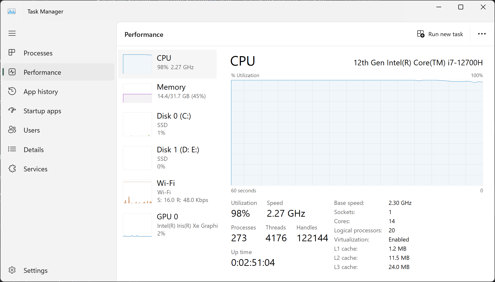
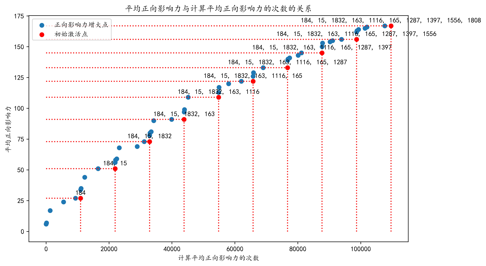
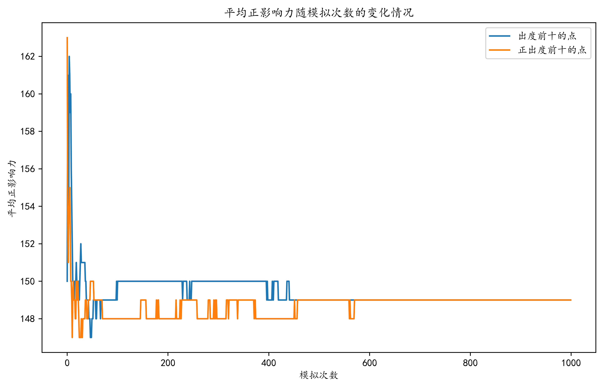

# Java 带符号网络正影响力最大化

[English](README.md)

这是一个 Java 课程项目，目标是在有向带符号社交网络中选择 10 个种子用户，使期望正影响力最大。项目结合了带符号独立级联扩散模型、蒙特卡洛估计、贪心种子选择和多线程候选节点评估。

## 问题定义

给定一个有向社交网络、概率扩散模型和种子规模 `k = 10`，选择一个种子节点集合，使最终被正向激活的节点期望数量最大。

每条边的格式为：

```text
源节点 目标节点 符号 激活概率
```

- `1` 表示正向关系，`-1` 表示负向关系。
- 新近激活的节点有一次机会激活每个尚未激活的出邻居。
- 激活成功后，目标节点状态为“源节点状态 × 边的符号”。
- 当网络中不存在新近激活节点时，扩散结束。
- 扩散具有随机性，因此通过多次蒙特卡洛模拟估计平均正影响力。

课程作业要求包括：

- 使用多个 Java 类实现扩散模型和种子节点选择流程；
- 给出最终 10 个种子节点、种子规模从 1 到 10 时的正影响力以及运行时间；
- 将贪心算法与出度前十、正出度前十两种启发式方法比较；
- 说明类的功能与关系、关键代码和实验结果。

## 代码结构

| 类 | 功能 |
| --- | --- |
| `DiffusionModel` | 模拟带符号级联过程并估计平均正影响力。 |
| `InitialNodesSelector` | 逐轮加入估计边际正影响力最大的候选节点。 |
| `GreedyAlgorithmMain` | 读取网络并执行 10 个种子节点的贪心搜索。 |
| `MethodComparison` | 比较五组贪心结果和两种度数基线。 |
| `ToolBoxAPI` | 提供数据读取、邻接映射缓存、度数统计、计时和绘图功能。 |

程序使用固定大小线程池并发评估候选节点，并通过并行流执行相互独立的蒙特卡洛扩散模拟。本仓库保留原始提交代码，只将原本与个人电脑绑定的数据和缓存路径改为仓库相对路径。



## 数据

| 内容 | 数量 |
| --- | ---: |
| 节点 | 10,966 |
| 有向边 | 44,356 |
| 正向边 | 32,822 |
| 负向边 | 11,534 |

- [`data/nodes.txt`](data/nodes.txt)：每行一个节点编号。
- [`data/edges.txt`](data/edges.txt)：每行依次为源节点、目标节点、符号和激活概率。
- 程序可在本地生成 `data/adjacency-map.ser` 缓存，该文件不会被 Git 上传。

## 实验结果

最终报告中的贪心搜索使用 500 次模拟估计每个候选集合的平均正影响力，得到：

```text
[184, 15, 1832, 163, 1116, 165, 1287, 1397, 1556, 1808]
```

| 种子规模 | 新增节点 | 平均正影响力 |
| ---: | ---: | ---: |
| 1 | 184 | 27 |
| 2 | 15 | 51 |
| 3 | 1832 | 73 |
| 4 | 163 | 91 |
| 5 | 1116 | 109 |
| 6 | 165 | 122 |
| 7 | 1287 | 133 |
| 8 | 1397 | 145 |
| 9 | 1556 | 156 |
| 10 | 1808 | 167 |

最终种子集合经过 100,000 次蒙特卡洛模拟复核。报告中的方法比较结果为：

| 种子选择方法 | 平均正影响力 |
| --- | ---: |
| 贪心算法 | **167** |
| 出度最高的 10 个节点 | 149 |
| 正出度最高的 10 个节点 | 149 |

相较两种度数基线，贪心结果平均多激活 18 个正向节点，提升约 12.1%。由于扩散过程具有随机性，不同运行的结果可能略有波动。





## 构建与运行

需要 JDK 17 或更高版本以及 GNU Make。

```bash
make build
make run-greedy
make run-comparison
```

也可以直接运行：

```bash
javac -encoding UTF-8 -d build/classes src/*.java
java -cp build/classes GreedyAlgorithmMain
java -cp build/classes MethodComparison
```

请在仓库根目录执行命令，以便程序读取 `data/nodes.txt` 和 `data/edges.txt`。完整贪心搜索的计算成本较高；报告中的 500 次模拟实验在 Intel Core i7-12700H 上约耗时 4 小时 10 分钟。

## 目录结构

```text
.
├── assets/             # README 使用的规范化结果图片
├── data/               # 节点与带符号边数据
├── src/                # 仅修改相对路径的原始 Java 代码
├── .github/workflows/  # 编译检查
├── Makefile
├── README.md
└── README.zh-CN.md
```

课程汇报文件和报告 PDF 未包含在仓库中。
